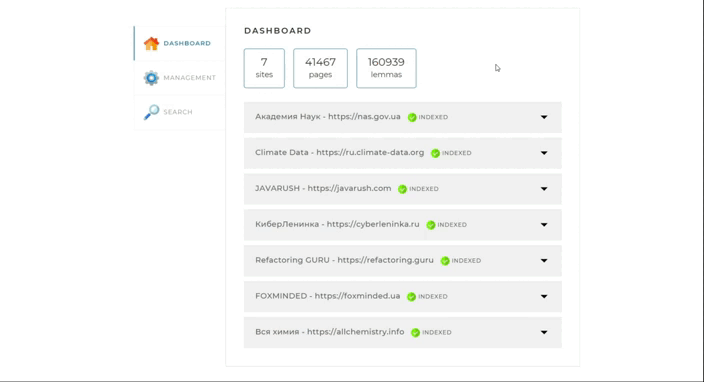

<h1 align="center">Local Search Engine</h1>

<p align="center">


</p>

---

## Description

**Local Search Engine** is a high-tech, load-tolerant tool that provides an API based on smart algorithms
for indexing and further analysis of the content of sites and their child elements - pages.

All information that has been processed by the built-in parser is stored
in a normalized database on the local machine. Thus, the user who will have access to the web interface is able to perform
search queries on indexed sites without Internet access.



---

## Working principle

+ In the ***config file***, before starting the application, a list of site addresses and their names is specified, by which the engine should search.

```yaml
sites:
  - url: https://www.site.com
    name: site-name
  - ...
```

+ When sending an HTTP request to start indexing, the parser **recursively** goes through all the pages available on the sites and **indexes** them.


+ The user also has the ability to index a **separate page** that belongs to one of the sites in the configuration.


+ Using the created index, you can find the most ***relevant pages*** for any search query.

+ The sent search query of the user is transformed into a set of so-called ***lemmas*** - words given in the basic form.

+ The index searches for pages where these lemmas occur.

+ The list of found pages is ranked by relevance and given to the user in the form of a list of ***snippets*** - readable sections of text containing the information you are looking for.


---

## Issues Affected
### 1. Cycle through pages
The parser obviously doesn't know the exact number of pages to crawl, so it crawls them **recursively**, starting from the main one.
> :exclamation: Any page can contain not only links to its child pages, but also links to those pages that are several levels **above**!

Naive traversal of all nested references can result in an infinite :repeat: loop. The solution to the problem lies in two things.
+ `First` is link filtering. A nested link **shouldn't**:
  + link to an external resource;
  + have anchors or document type other than **html**;
  + be equal to the link of the main or current page.

+ `Second` is **caching** links. For this, **Redis** and its _set_ data structure are used, which stores unique members by the specified key.
  If the parser has already visited some page, it will know about it from Redis :sunglasses:

> You can see the implementation of the **validLinks** method [HERE](./src/main/java/searchengine/services/RecursiveWebParser.java).

### 2. Minimizing the number of queries in the database
I/O operations are the bottleneck in the vast majority of systems. Close attention should be paid to the optimization of work with the database.
All data (entity objects) are **buffered** and sent to the database in batches, which contributes to a significant performance boost. After completion of all
the data remaining in the buffer is flushed to the database, and the resources are cleared. Search queries are cached.

> You can drop anything - but never drop the database. She, as an ex, will always remind of herself :trollface:

### 3. RAM limit within the application
The virtual machine is allocated a finite amount of memory. The system uses ORM technology that displays the received data
as objects stored in heap. The system is processing a large amount of data, which can cause this heap to overflow and crash :warning:.
Therefore, information is provided in portions, reducing the load on the system.

### 4. Reaction to a stoplight
The indexing emergency termination mechanism has been implemented: when a necessary HTTP request is called, the system interrupts all work tasks.

___

## Technology stack
+ Java 17
+ Maven
+ Spring/Spring Boot 3, Thymeleaf
+ PostgreSQL, Redis
+ Apache Lucene

---

## Instructions for running the program locally

### System requirements

>**Processor**: 4-Core Intel Xeon 500 Sequence, AMD Athlon X4 Bristol Ridge
>
>**RAM**: 8GB RAM
>
>**Hard disk space**: 10 GB

### Procedure
+ First you need to create an empty database in PostgreSQL. You can come up with any name.

+ Clone the project to your working directory:

```git clone https://github.com/KonstantinLi/search_engine```

+ Open the project in any IDE with support for the Maven builder.
  Recommended by **IntelliJ IDEA Ultimate Edition** for lightweight work with Spring and database tools.
  + Java: 17+
  + PostgreSQL: 15+

+ Create a startup configuration for the Spring Boot project, in which you need to specify:
  + **Application** class annotated with @SpringBootApplication
  + Project name optional
  + Java 17+
  + It is recommended to specify the **-Xmx4096M** property in the VM options, which means 4 GB of memory allocated for the application

+ The project from the box contains the default configuration file **application.properties**, which connects the built-in HSQLDB database, but its application
  not recommended in production. Therefore, in the **src/main/resources/config** folder, create the **application.yaml** file and specify the following configuration:

```yaml
spring:
  datasource:
    username: user
    password: pass
    url: jdbc:postgresql://localhost:port/database?useSSL=false&reWriteBatchedInserts=true

  jpa:
    properties:
      hibernate:
        dialect: org.hibernate.dialect.PostgreSQL95Dialect

indexing-settings:
  sites:
    - url: https://www.site.com
      name: site-name
```

+ Enter your database data:
  + ***user*** - username
  + ***pass*** - password
  + ***port*** - reserved port
  + ***database*** - database name

+ In **indexing-settings.sites** enter your list of **url-name** values of indexed sites.

+ By setting the **spring.jpa.show-sql** property to **true**, all SQL queries will be visible in the console.vvvvv