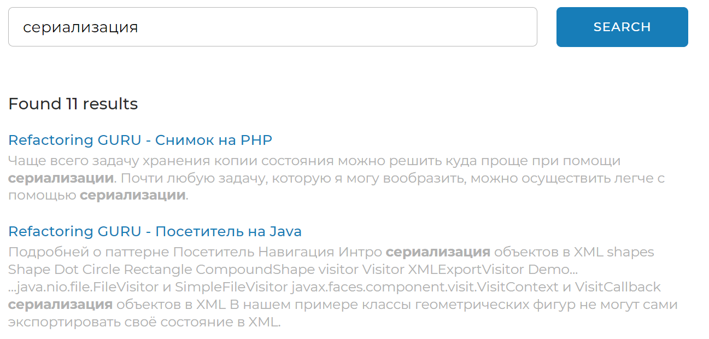

<h1 align="center">Локальный поисковой движок по сайтам</h1>

<p align="center">


</p>

---

## Описание

**Локальный поисковой движок** - высокотехнологичный, устойчивый к нагрузкам инструмент, предоставляющий API, в основу которого положены умные алгоритмы
для индексации и дальнейшего анализа контента сайтов и их дочерних элементов - страниц. 

Вся информация, которая была обработана встроенным парсером, хранится
в нормализованой базе данных на локальной машине. Таким образом, пользователь, который будет иметь доступ к веб-интерфейсу, способен совершать
поисковые запросы по индексированым сайтам без доступа в Интернет.


---

## Принцип работы

+ В ***конфигурационном файле*** перед запуском приложения задается список адресов сайтов и их имен, по которым движок должен осуществлять поиск.
```yaml
sites:
  - url: https://www.site.com
    name: site-name
  - ...
```

+ При отправке HTTP-запроса о начале индексации парсер **рекурсивно** обходит все доступные на сайтах страницы и **индексирует** их.


+ Пользователь так же имеет возможность проиндексировать **отдельную страницу**, которая принадлежить одному из сайтов в конфигурации.


+ С помощью созданного индекса можно находить наиболее ***релевантные страницы*** по любому поисковому запросу.

+ Отправленный поисковой запрос пользователя трансформируется в набор так называемых ***лемм*** - слов, приведенных в базовую форму.

+ В индексе ищутся страницы, на которых встречаются данные леммы.

+ Список найденных страниц ранжируется по релевантности и выдается пользователю в виде списка ***сниппетов*** - читабельных отрезков текста, содержащих искомую информацию.



---

## Затронутые проблемы
### 1. Циклический обход страниц
Парсер заведомо не знает точное количество страниц, которые нужно обойти, поэтому он обходит их **рекурсивно**, начиная с главной.
> :exclamation: Любая страница может содержать не только ссылки на свои дочерние страницы, а так же ссылки на те страницы, которые находятся на несколько уровней **выше**!

Наивный обход всех вложенных ссылок может привести к бесконечному циклу :repeat:. Решение проблемы заключается в двух вещах.
+ `Первое` - это фильтрация ссылок. Вложенная ссылка **не должна**:
  + ссылаться на внешний ресурс;
  + иметь якорей или тип документа, отличный от **html**; 
  + быть равна ссылке главной или текущей страницы.

+ `Второе` - это **кеширование** ссылок. Для этого используется **Redis** и его структура данных _set_, которая хранит уникальные members по указанному key. 
Если парсер уже побывал на какой-то странице, он об этом узнает из Redis :sunglasses:

> Посмотреть реализацию метода **validLinks** можно [ТУТ](./src/main/java/searchengine/services/RecursiveWebParser.java).

### 2. Минимизация количества запросов в БД
I/O операции - узкое место в подавляющем большинстве систем. На оптимизацию работы с БД следует приделить пристальное внимание.
Все данные (объекты сущностей) **буферизируются** и отправляются в БД пакетами, что способсвует значительному приросту в производительности. После завершения работы все
оставшиеся в буфере данные сбрасываются в БД, и ресурсы очищаются. Поисковые запросы кешируются. 

> Можно забросить что угодно - но БД не бросай никогда. Она, как бывшая, будет всегда напоминать о себе :trollface:

### 3. Ограничение ОЗУ в рамках приложения
Виртуальной машине выделяется конечный объем памяти. Система использует технологию ORM, которая отображает полученные данные
в виде объектов, хранящихся в heap. Система обрабатывает большой объем данных, что может вызвать переполнение этого heap и аварийно завершить свою работу:warning:.
Поэтому информация предоставляется порционно, снижая нагрузку на систему.

### 4. Реакция на стоп-сигнал
Реализован механизм экстренного прекращения индексации: при вызове нужного HTTP-запроса система перерывает все рабочие таски.

___

## Стек технологий
+ Java 17
+ Maven
+ Spring/Spring Boot 3, Thymeleaf
+ PostgreSQL, Redis
+ Apache Lucene

---

## Инструкции по локальному запуску программы

### Системные требования

>**Процессор**: 4-Core Intel Xeon 500 Sequence, AMD Athlon X4 Bristol Ridge
> 
>**Оперативная память**: 8 ГБ ОЗУ
> 
>**Место на жестком диске**: 10 ГБ

### Порядок действий
+ Для начала необходимо создать пустую базу данных в PostgreSQL. Название можно придумать любое.

+ Клонируйте проект в свою рабочую директорию: 

```git clone https://github.com/KonstantinLi/search_engine```

+ Откройте проект в любой IDE с поддержкой сборщика Maven. 
Рекомендовано **IntelliJ IDEA Ultimate Edition** для облегченной работы со Spring и инструментами БД.
  + Java: 17+
  + PostgreSQL: 15+
  
+ Создайте конфигурацию запуска проекта Spring Boot, в которой нужно указать:
  + Класс **Application**, аннотированный @SpringBootApplication
  + Имя проекта по желанию
  + Java 17+
  + Рекомендуется указать свойство **-Xmx4096M** в VM опциях, что означает выделенную для приложения память объемом 4 ГБ

+ Проект с коробки содержит дефолтный файл конфигурации **application.properties**, который подключает встроенную базу данных HSQLDB, но её применение
  в production не рекомендовано. Поэтому в папке **src/main/resources/config** создайте файл **application.yaml** и укажите следующую конфигурацию:

```yaml
spring:
  datasource:
    username: user
    password: pass
    url: jdbc:postgresql://localhost:port/database?useSSL=false&reWriteBatchedInserts=true

  jpa:
    properties:
      hibernate:
        dialect: org.hibernate.dialect.PostgreSQL95Dialect

indexing-settings:
  sites:
    - url: https://www.site.com
      name: site-name
```

+ Внесите свои данные БД:
  + ***user*** - имя пользователя
  + ***pass*** - пароль
  + ***port*** - зарезервированный порт
  + ***database*** - имя БД

+ В **indexing-settings.sites** внесите свой список значений **url-name** индексируемых сайтов.

+ Указав свойству **spring.jpa.show-sql** значение **true** все SQL-запросы будут видны в консоли.